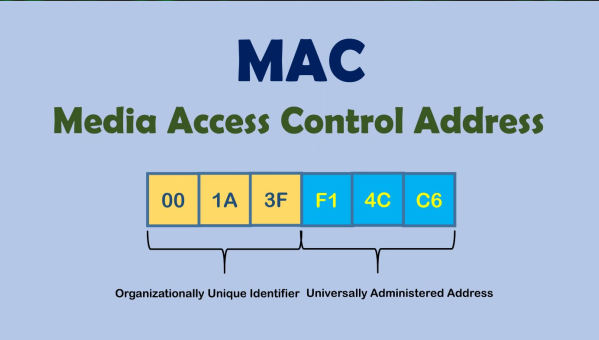
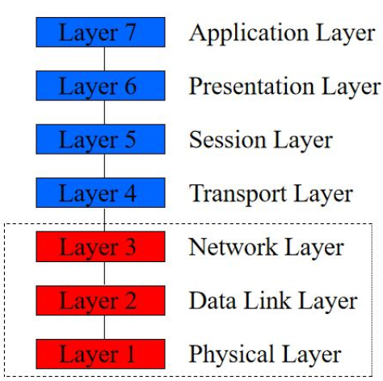
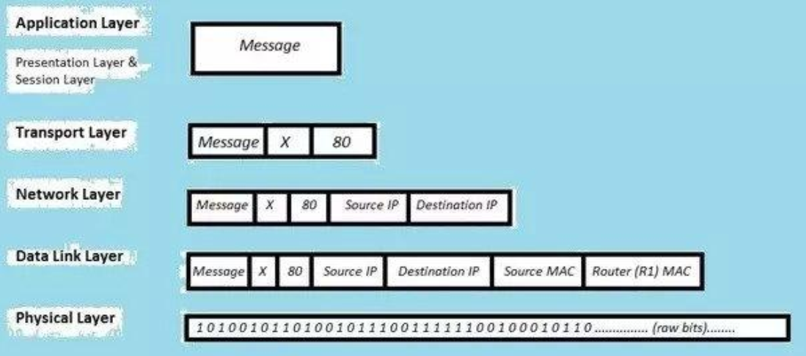
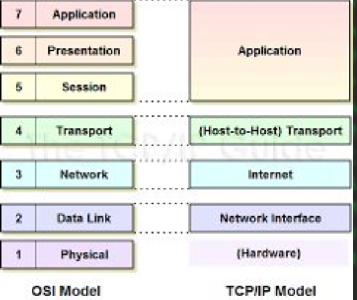
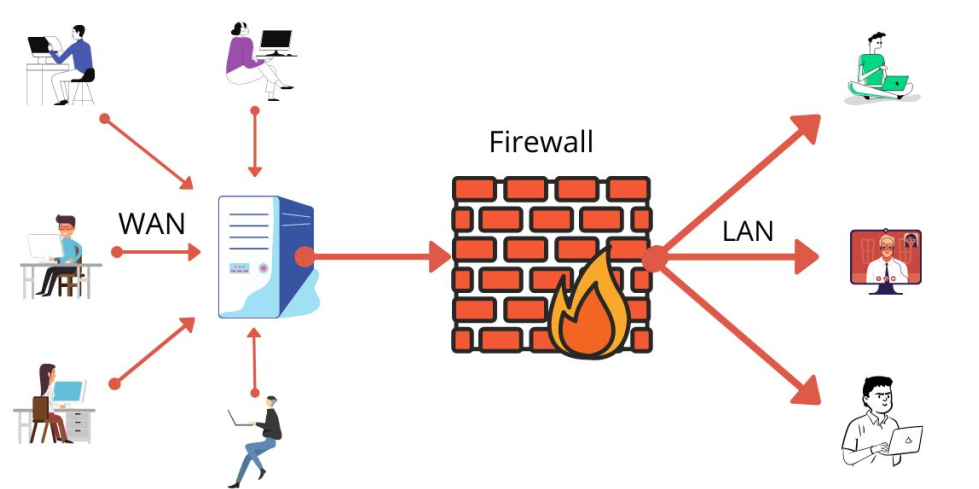
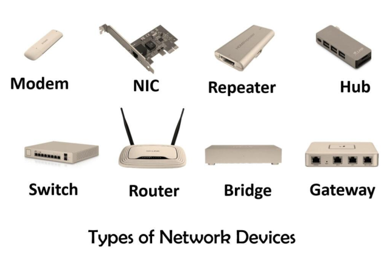

# Networking for Hackers

<u><b>Topics</b></u>
+ Introduction to networking
+ Classification of networks
+ IP Address
+ Mac Address
+ OSI Model
+ TCP and UDP protocols
+ TCP/IP Model
+ Networking tools

## Introduction to Networking
+ A network consists of two or more entities or objects sharing resources and information.
+ A computer network consists of two or more
computing devices connected to each other to share
resources and information.
+ Computers on a network can act as a client or a server.

### Client
+ A client is a computer that requests for resources.

### Server
+ A server is a computer that controls and provides access to resources.
+ But have higher RAM,CPU and STORAGE

## Need of Networks
+ Enhance communication.
+ Share resources.
+ Facilitate centralized management
+ Internet

## Classification of Networks
1. Classification by network geography.
2. Classification by component roles.

## Classification by Network Geography
+ Networks are frequently classified according to
the geographical boundaries spanned by the network itself.
    + LAN
    + WAN
    + MAN 
### Local area network (LAN)
+ A LAN covers a relatively small area such as a classroom,school, or a single building.
+ LANs are inexpensive to install and also provide higher speeds.

### Metropolitan area network (MAN)
+ A MAN spans the distance of a typical metropolitan city.
+ The cost of installation and operation is higher.
+ MANs use high-speed connections such as fiber
optics to achieve higher speeds

### Wide area network (WAN)
+ WANs span a larger area than a single city.
+ These use long distance telecommunication networks for connection, thereby increasing the cost.
+ The Internet is a good example of a WAN

## Classification by Component Roles
+ Networks can also be classified according to
the roles that the networked computers play
in the network’s operation.
    + Peer-to-peer
    + Server-based
    + Client-based

### Peer-to-peer
+ In a peer-to-peer network, all computers are considered equal.
+ Each computer controls its own information and is capable of functioning as either a client or a server depending upon the requirement.

### Server based
+ A server-based network offers centralized control
and is designed for secure operations.
+ In a server-based network, a dedicated server
controls the network.
+ A dedicated server is one that services the network
by storing data, applications, resources, and also
provides access to resources required by the client.

### Client-based
+ Client-based network servers process requests from
clients and return just the results.
+ These networks take advantage of the powerful
processing capabilities of both the client and the
server.
+ Application servers and communications servers are
examples of client-based networks.

## IP /Internet Protocol/ address
+ IP (Internet Protocol) is a
Network Layer Protocol.
+ A way to identify
machines on a network
+ A unique identifier

## IP types
+ Based On IP versions
    + IPv4
    + IPv6
    
## IPv4 ( Internet protocol version 4)
+ An IPv4 address is a 32-bit sequence of 1s and 0s.
+ To make the IP address easier to use, the address is
usually written as four decimal numbers separated by
periods.
+ This way of writing the address is called the dotted
decimal format.
+ IP generated by DHCP or Manually

## :fire: Network Address :fire:Gateway Address :fire:Broadcast address

+ A network address is an important concept in computer networking. It is used to identify a network or subnet and is the first IP address in a range of IP addresses assigned to that network. For example, if a network has been assigned the IP address range 192.168.1.0/24, the network address would be 192.168.1.0. This address cannot be assigned to any device on the network because it is reserved for identifying the network itself.

+ A gateway address, on the other hand, is used to connect two or more networks together. It is the IP address of a device such as a router that is responsible for routing traffic between different networks. For example, if a company has two different networks, one with the IP address range 192.168.1.0/24 and another with the IP address range 192.168.2.0/24, a router with two network interfaces could be used to connect these two networks together. The gateway address on each network would be set to the IP address of the router interface that is connected to that network.
    + Forward data from one network to another

+ Finally, a broadcast address is used to send a message to all devices on a network at once. This is useful for sending messages such as network announcements or requests for information from all devices on a network. The broadcast address is the last IP address in a range of IP addresses assigned to a network. For example, if a network has been assigned the IP address range 192.168.1.0/24, the broadcast address would be 192.168.1.255. This address cannot be assigned to any device on the network because it is reserved for broadcasting messages to all devices on the network.

[Nice Video Here](https://www.youtube.com/watch?v=pCcJFdYNamc&t=81s)

+ Every IP address has two parts:
    + Network: to identify the network( የእናንተ,የጎረቤት)
    + Host: identify the user(ስልክ,PC)

## Private and Public IP addresses.
+ Any HOST have 2 different IP’s
    + Public IP:
        + is an ip address that is given to the host on the
    WAN network
    + Private IP:
        + is ip that is given to the host on LAN network.

+ There are 5 classes of private IP address A B C D
and E
+ CLASS A: Governments
+ CLASS B: medium Companies
+ CLASS C: small companies
+ CLASS D: MultiCasting(streaming)
+ CLASS E: Future Use (IETF research)

## CLASS A
+ Have 24bit of space for HOSTS
## CLASS B
+ Have 16bit of space for HOSTS
## CLASS C
+ Have 8bit of space for HOSTS and 24-bit of network

## Reserved IP Addresses
+ Certain host addresses are reserved and cannot be assigned to devices on a network.
+ Addresses beginning 127 are reserved for loopback and internal testing
+ An IP address that has binary 0s in all host bit positions is reserved for the network address.
+ An IP address that has binary 1 or 255s in all host bit positions is reserved for the broadcast address
  + Examples of Reserved addresses
    + 0.0.0.0
    + 127.0.0.0
    + 128.0.0.0
    + 191.255.0.0
    + 192.0.0.0
    + 223.255.255.0

## IPv6 ( Internet Protocol Version 6)
+ IPv6 is a 128-bit alphanumeric long value that
identifies an endpoint devices in IPv6 network.
+ Format of an IPv6 address:
    + FE80:CD00:0000:0CDE:1257:0000:211E:729C
        + ALPHANumeric
        + Separated by colon( : )
+ IP generated automatically.

👉The main difference is the IP-space(host holding)
IPv4 holds 32-bit ip address but IPv6 holds 128-bit
ip Addresses.

## MAC(Media Access Control) Address
+ It is Given by A manufacturer of that network adapter.
+ Network adapter is a hardware device that helps us to have connection ( our wifi adapter or our internet port)
    + It is Alphanumeric, with 2 part
        + Organizational Unique Id
        + Network Interference control(NIC)
 

 

+ Flat name space of 48 bits
    + Typically written in six octets in hex
        + E.g., 00-15-C5-49-04-A9 for my Ethernet
+ Organizationally unique identifier    
    + Assigned by IEEE Registration Authority
    + Determines the first 24 bits of the address
        + E.g., 00-15-C5 corresponds to “Dell Inc”

## OSI(Open Systems Interconnection) Reference model
+ OSI Reference Model - internationally standardised
network architecture.
+ It is an idea model to show the way of network work
+ Model has 7 layers.
+ It shows How Data transfers between 2 hosts/servers

👉 Layers 1-4 relate to communications technology.

👉 Layers 5-7 relate to user applications.

● The sequence difference  when sender and receiver

 

 

### Layer 7: Application Layer
+ Level at which applications access network services.
    + Represents services that directly support
software applications for file transfers, database
access, and electronic mail, BROWSERS etc.
+ Your data is 👉 DATA
    + PROTOCOLS: HTTP,FTP,SMTP

### Layer 6: Presentation Layer
+ Related to representation of transmitted data
    + Translates different data representations from the
Application layer into uniform standard format
+ Providing services for secure efficient data
transmission
    + e.g. data encryption, and data compression.
+ Your data is 👉 DATA
+ PROTOCOLS: SSL

### Layer 5: Session Layer
+ Allows two applications on different computers to
establish, use, and end a session.
    + e.g. file transfer, remote login
+ Establishes dialog control
    + Regulates which side transmits, plus when and how long it transmits.
+ Performs token management and synchronization.
+ Your data is 👉 DATA
+ PROTOCOLS: RPC,NETBIOS

### Layer 4: Transport Layer
+ Manages transmission packets
    + Repackages long messages when necessary into small packets for transmission [ sender ]
    + Reassembles packets in correct order to get the original message. [ receiver ]
+ Handles error recognition and recovery.
    + Transport layer at receiving acknowledges packet delivery.
    + Resends missing packets
+ Your data is 👉SEGMENTS
+ PROTOCOLS: TCP,UDP

### Layer 3: Network Layer
+ Manages addressing/routing of data within the ip range
    + Addresses messages and translates logical addresses and names
into physical addresses.
    + Determines the route from the source to the destination
computer
    + Manages traffic problems, such as switching, routing, and
controlling the congestion of data packets.
+ Your data is 👉 PACKETS
+ PROTOCOLS: ICMP,ARP,NAT,IP

### Layer 2: Data Link Layer
+ Packages raw bits from the Physical layer into frames (logical, structured packets for data). [ receiver ]
+ Provides reliable transmission of frames
    + It waits for an acknowledgment from the receiving
computer.
    + Retransmits frames for which acknowledgement not
received
+ Your data is 👉FRAMES
+ PROTOCOLS: PPP,NDP,CDP

### Layer 1: Physical Layer
+ Transmits bits from one computer to another
+ Regulates the transmission of a stream of bits over a physical medium.
+ Defines how the cable is attached to the network adapter and what
transmission technique is used to send data over the cable. Deals with issues like
    + The definition of 0 and 1, e.g. how many volts represents a 1, and how long a bit lasts?
    + How many pins a connector has, and what the function of each pin is?
+ Your data is Bits
+ PROTOCOLS/DEVICES: RS-449

### Summary

 

[Read More](https://www.lifewire.com/layers-of-the-osi-model-illustrated-818017)

## TCP and UDP

TCP (Transmission Control Protocol)
+ Reliable
+ Connection-Oriented protocol
    + Means it establishes a connection between the receiver and sender.
+ It uses 3 way HandShake 
+ Used on emails, Chat,watching online videos, simple
browsing

### UDP(User Datagram Protocol)?
+ Connectionless
+ less reliable, but faster and more straightforward.
+ It’s often used in situations where higher speeds
are crucial, like in streaming or gaming

## TCP/IP model
+ It is A reference model like the OSI model
+ TCP/IP is the new and most used Model at this time.
+ This model have 5 layers
#
Application,Presentation and session layers are
combined together and called APPLICATION

 

## Firewall
+ A firewall is a network security device that  monitors incoming and outgoing network traffic and decides whether to allow or block specific traffic based on a defined set of security rules.
+ It is Just A collection of rules to allow and deny network traffics
    + Ex: You can’t directly access some host directly from other Network.

 

## Networking tools

 

### Repeater
+ Helps To boost/amplify the speed of the internet, in long route

### Bridge
+ Used to Connect different LANs
