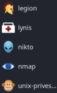

# Linux For User

 👉 Kali Linux - formerly known as BackTrack Linux.

+ Kali Linux is a Linux based operating system, mostly used in **penetration testing**. 
+ There are different types of **tools** that are present in Kali Linux to perform different operations. 

### 1 <u>**Information Gathering:**</u>

+ Tools for information gathering, in system, network, host. 
👉 Some of the tools are: 
 

 

👉 **Nmap** is the most famous in these tools. 

### 2 <u>**Vulnerability Analysis:**</u>
+ Tools for Finding Vulnerabilities.
 
👉 Some of the tools are: 
 

 

### 3 <u>**Web Application Analysis:**</u>
 + Tools for Finding Vulnerabilities and exploits on **websites.**
 
👉 Some of the tools are: 
 

 

👉 Burpsuite, vega, and web scarab are some most famous tools.

### 4 <u>**Database Assessment:**</u>
 + Tools for Finding Vulnerabilities and exploits on **Databases.**
  
👉 Some of the tools are: 
 

 

👉 Sqlmap is the most famous database assessment tool. This ool injects SQL injection for scanning, detecting, and exploitation.

### 5 <u>**Password Attacks:**</u>
+ Tools for exploiting Passwords for login,websites,application,
windows.
 
👉 Some of the tools are: 
 

 

👉 John the Ripper and Medusa are the most famous tools.

### 6 <u>**Wireless Attacks:**</u>
 + Tools for exploiting Wireless Systems like wifi, bluetooth.
 
👉 Some of the tools are: 
 

 

👉 Aircrack-ng and Ghost Phisher are the most famous tools.

### 7 <u>**Reverse Engineering:**</u>
 + Tools for exploiting Softwares, Mobile Applications and any
binary files.
 
👉 Some of the tools are: 
 

 

👉 Most famous tools are ollydbg and apltools.

### 8 <u>**Exploitation Tools:**</u>
 + Tools for exploiting Softwares, Mobile ,Computers ,websites and
any things.
 
👉 Some of the tools are: 
 

 

👉 The most famous tool is Metasploit.

### 9 <u>**Sniffing and Spoofing:**</u>
 + Tools for Listening or hijacking networks.
 
👉 Some of the tools are: 
 

 

👉 The most used tool is Wireshark.

### 10 <u>**Post Exploitation:**</u>
+ Tools for Maintaining our access. Used after exploiting a system
 
👉 Some of the tools are: 
 

 

👉 The most famous tool is Powersploit.

### 11 <u>**Forensics:**</u>
 + Tools for Doing researches and investigate a Cyber Attacks.
 
👉 Some of the tools are: 
 

 

👉 The most famous tool is Autopsy, it has also been used by security forces, many judicial and investigating officials.

### 12 <u>**Reporting Tools:**</u>
 + Tools for Report preparation. After some forensic you will get  data and you will write report and these tools will help
you.
 
👉 Some of the tools are: 
 

 

👉 Most famous tools are faraday, Dradis, and Pipal.

### 13 <u>**Social Engineering:**</u>
+ Tools Used for Social Engineering attacks
 
👉 Some of the tools are: 
 

 

👉 The most famous social engineering tool is SET.     

[Read More](https://www.geeksforgeeks.org/kali-linux-tools/)
 
***
***
*** 
### Workspace manager:
+ Used to Classify our works on differentwindows
### Folder managers
   1. Dolphin
   2. Thunar
   3. Nautilus
 
***
***
***

## <u>**Linux Commands**</u>
 + Linux Systems uses shell. The shell help us to Communicate with the kernel and helps to execute codes. 
👉 Shell also called “Terminal”.

  + The terminal have 5 parts:
        <ol type="i">
            <li>Username = rexder</li>
            <li>Hostname = HunterMachine</li>
            <li>Current Directory = PATH</li>
            <li>Priviledge = $-(user) , #-(root)</li>
            <li>Command place = _</li>
        </ol> 

 
 
 + Home directory is ~
 + Local directory with .
 + All directory *

👉 The tilde (~) 

Also those commands have their own options and arguments.
 

👉 command is “Small programs that do one task well”

  
  ## ls / List Directory

    ls -a     : for all files including hidden files.

👉 Hidden files and directories (folder) start with { . } Dot.

    ls -l     : a long listing format option we can do 
                   > Check File Permissions.
                   > Check the Modified Time Of A File.
                   > Check File Size.
 
   
    ls -R {Capital R}   : To Check Subdirectories In Linux  Terminal.
                         👉 recursive
                        
## cd / Change Directory
+ It is used to change current working directory.

      cd /        : root
      cd =>       : home
      cd ..       : 1x Back
      cd ../..    : 2x Back
      cd "foldername"

## Pwd / print working directory
 + It prints the path of the working directory,
starting from the root.

        pwd

## echo
+ used to display line of text/string that are passed as an argument.

      echo "Hello World"
      echo text > file.txt         : write texts into files.
      echo text >> file.txt        : add texts(append)

## cat
Used to show the content of a file.

      cat file.txt 

## head
 + prints the **first** 10 lines of the specified files.

 ## tail
 + prints the **last** 10 lines of the specified files.

 ## tail
 + shows a file's contents one screen at a time.

  ## touch
+ Creates any kind of Files with the name
you gave it. With empty inside.

      touch file.txt markdown.md

## mkdir / make directory
+ Creates Folder with the name u gave it.

      mkdir FirstFolder SecondFolder

## clear
 + Clears your screen.

 ## rm / remove
 + Remove file.
  
        rm -i         : makes the command ask the user for        
                        infirmation before removing each ile      
                    👉 Interactive Deletion

 

            
    rm -f            : rm prompts for confirmation removal if a file is 
                       writeprotected.The -f option overrides this minor 
                       protection and removes the file forcefully.
                    👉 Force Deletion

 

            
    rm -r            : performs a tree-walk and will delete all 
                       the files and sub-directories recursively of the 
                       parent directory. At each stage it deletes everything  rm -r *
                       it finds. Normally, rm wouldn’t delete the directories
                       but when used with this option, it will delete. 
                    👉 Recursive Deletion

 ## cp / Copy
+ cp stands for copy. This command is used to copy files or group of files or directory. 
     Two file names :
    
      cp Src_file Dest_file
  One or more arguments:
        
      cp Src_file1 Src_file2 Src_file3 Dest_directory

  Two directory names :

       cp -R Src_directory Dest_directory

  [Read More](https://www.geeksforgeeks.org/cp-command-linux-examples/)

 ## mv / Move
 + mv stands for move. 
 + It renames a file or folder. 
 + It moves a group of files to a different directory. 
 [Read More](https://www.geeksforgeeks.org/mv-command-linux-examples/)

 ## grep
+ The grep filter searches a file for a particular pattern of characters, and displays all lines that contain that pattern.
1. Case insensitive search : 
      
        $grep -i "UNix" geekfile.txt
 2. Displaying the count of number of matches :

         $grep -c "unix" geekfile.txt

3. Display the file names that matches the pattern :

        $grep -l "unix" *

4. Rearch recursively for a pattern in the directory:
    $grep -R [Search] [directory]

[Read More](https://www.geeksforgeeks.org/grep-command-in-unixlinux/)

 
## wc / word coun
+ It is used to find out number of lines, word count, byte and characters count in the files specified in the file arguments.

👉 Line(-l)  
👉 word(-w) 
👉 byte(-c)
 

[Read More](https://www.geeksforgeeks.org/wc-command-linux-examples/)

***
***
## **Multiple Command Executions**
You can run/ execute multiple commands in 1 line. ● using 3 methods:
+ And ( && )
+ Or ( || )
+ Pipeing( | )
