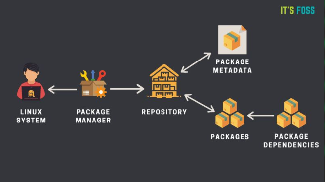

# **Advanced Linux User**

## Some advanced user commands  

 **To change password of user**

    sudo passwd username
 **To change user id**

    sudo usermod -u new_id username
**To Delete User**

    sudo userdel -r username

**To Change users on terminal**

    su      : to root
    su [username]       :to non-root

## Sudoers file
+ The sudoers file is a file Linux and Unix administrators use to
allocate system rights to system users
+ The user you created 👉 **doesn’t** have power to use sudo as the
original one.
+ This is Because it is not Added in the sudoers file ( የSudoዎች file )

**To access this file**

    sudo visudo

## What is the use of visudo?
+ The visudo command opens a text editor like normal, but it validates the syntax of the file upon saving. This prevents configuration errors from blocking sudo operations, which may be your only way of obtaining root privileges. 
+ Traditionally, visudo opens the /etc/sudoers file with the vi text editor.

## Linux File permission
+ Every file on linux have their own
    + Owner
    + Permissions
+ There is 5 main parts on the listing
    + Permission
    + Owners
    + Date
    + Size
    + filename

## Ownership 
+ Ownership is the owner of the file
+ This have 2 kinds
    + User
    + Group

**To change the owner of file**

    sudo chown userName:groupName filename

## Permission
+ There are 3 types of permissions
    + Read ( r )
    + Write ( w )
    + Execute ( x )

👉 The folders and files are differ with
the **‘d’** and **‘-’** on the beginning of the permission.

+ There still the permission have three parts.
    + user 
    + group
    + other
+ User ( u ) => power of user defined on the the ownership
+ Group (g )=> power of group defined on the the ownership
+ Other ( o ) => power of other users.
+ All ( a ) => power of all which can be found in the 3 above owners

**Command to change permission of file**

    chmod <option> filename

**Chmod command**
+ This command helps to change file permission.
● Each of the permission have a number representations.
    + Read -> 4 - r
    + Write -> 2 - w
    + Execute -> 1 - x

👉 **+** Is giving the permission

👉 **-** Is taking / removing “ “

:fire: The parameter can be in **numbers** and **symbols** 

1. **Parameters in symbol**

    -> adding execute permission for all

       chmod a+x filename 
    -> adding execute permission for user     
       
       chmod u+x filename 
    -> adding execute permission for group
        
       chmod g+x filename 
    -> adding execute permission for other

       chmod o+x filename 
    -> removing execute permission for all
    
       chmod -x filename 
    -> gives rwx for all and removes something from all

       chmod a+rwx , u-rw , g-x , o-xw filename 
2. **Parameters in Number**

    -> 6 for user, 2 for group, 1 for other ( 6 = 4+2 ), 6 =r w

       chmod 621 filename 
    -> 7 for users, 7 for group , 7 for others (7 =4+2+1), 7 = rwx
  
       chmod 777 filename 
***

## Package installation on linux

 

+ On linux to install softwares you use package managers. 
👉 Ex: apt,pacman,pkg,...
+ On debian the package manager is called ‘APT’ also there is called ‘dpkg’
+ Package managers are a free-software user interface that **work with an online
server** to handle the **installation** and **removal of software** on Debian, and
Debian-based Linux distributions.

## The Repository
+ This is the site/ server kali use to upload the packages

## Advanced package tool / apt /
+ Apt is a free-software user interface that work with an online server to handle the installation and removal of
software on Debian, and Debian-based Linux distributions.used for online and offline purpose. 

👉 The old ‘apt’ used as ‘apt-get’

**Syntax**

       sudo apt update
       sudo apt search <softwarename>
       sudo apt install <softwarename>
       sudo apt remove <softwarename>
       sudo apt upgrade
       sudo apt purge <softwarename>

## Package dependencies
+ A software can be built based on another program called **‘modules’**
so, a program to work properly, the dependencies have to be installed successfully.
+ Those package managers install the software+dependencies.

**Dpkg / Debian package manager /**
+ Dpkg is an offline package managing
program.
+ Packages on debian have an extension “.deb”

**Syntax**

      sudo dpkg -i <packagename>
      sudo dpkg -r <packagename>
      sudo dpkg -P <packagename>

