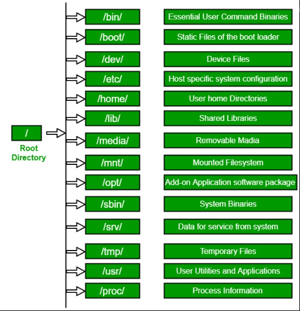

# Further on Linux

👉 **File system** is a directory structure that the OS uses.
  + **Windows:** System files appear under the local disk C:             
  
        C:\Windows\System32

 + **Linux:** System files appear under the root

        directory ( / )

## What is the difference between the :fire:<u>root (/)</u> and the :fire:<u>root directory</u>?
 

+ **/** is the main tree (root) of the whole Linux file-system
+ All files and directories are logically contained inside the root directory regardless of their physical locations.  
 :fire: and 
+ **/root** is the admin's user-directory, equivalent to yours in /home/username
+ /root is the root user's (more precisely the user with UID 0's) home directory.

👉 /root is the root user’s home directory, 👉 which is not the same as /
 

 

+ A bootloader is a program written in machine code that loads the operating system into RAM during the boot process.

**Single-user mode** and **multi-user mode in linux?**

+ A Single-User Operating System is a system in which only one user can access the computer system at a time. 
+ A Multi-User Operating System is a system that allows more than one user to access a computer system at one time. The bootloader loads all the resources of the CPU in the profile of a single superuser.

[Read More](https://www.geeksforgeeks.org/linux-file-hierarchy-structure/)

***
***
### Text Editors
+ Programs That user for text processing. 
👉 Linux **command line text editors**: 
     
        > VIM
        > Nano
        > Emacs
        > Neovim

  👉 Linux **Graphical Text editors**: 
     
        > Sublime
        > Vscode
        > Gedit
        > Pluma 

### **VIM**
+ Before **vi** the primary editor used on Unix was the **line editor.** 
😭 User was able to see/edit only one line of the text at a time. 
💪 Then then vi editor improved and developed VIM. ( VI 😎iMproved)

+ The vim editor is:
   + a very powerful
   + but at the same time it is cryptic
   + It is hard to learn, specially for windows users

+ It have to modes
  + Command mode -> where you can do commands
  + Input mode -> where you can write

Opening Vim:

    vim filename.txt

 👉 Vim is by default on **command mode** when you open it.

To get on insert mode you:

    i
To get back to command mode you press: 
    
    esc
Save:

    :w
Quit:

    :q
Save and Exit:

    :wq!
Undo:

    :u  or undo
Execute commands:

    :%! yourcommand

[Read More](https://www.geeksforgeeks.org/getting-started-with-vim-editor-in-linux/)

### **NANO**
+ The GNU nano text editor is a user-friendly, free and open-source text editor that usually comes pre-installed in modern Linux
systems.

Starting nano

    nano filename
 

    Ctrl + S - save
    Alt + U - Undo 
    Alt + E - Redo
    Ctrl + X - Exit
    👉 the ^ is equal to ‘Ctrl’

You can append texts from other files with 

    Crtl + R and Specify the Path
 

    Ctrl+shift+C - copy
    Ctrl+shift+X - Cut
    Ctrl+shift+V - Paste

***
***
   
## Linux User Management

+ On Computer system, person who uses the computer is called **“user”**
+ Every Users have Group.
+ Users have their own file & applications.
+ To know our name on linux
        
        whoami

+ Those users have power/privilege.

👉 On linux there's 2 kinds users.

        +  Root id = 0
        +  Normal User id start with 1-999

+ The root user have the power to do **💪everything on linux** ,
+ if users want to have a root access they add **sudo** in front of the command .

+ **sudo** = superuser do or substitute user do

### Creating Users
+ On linux, to create users you can use the following commands 
    👉 Useradd -> simple 
    👉 Adduser -> Detailed 
+ Useradd command

      sudo useradd username
+ Adduser command

      sudo adduser username

+ The User files are stored inside 

      /etc/passwd
+ The User password are stored inside 

      /etc/shadow

👉 When you create a user it creates a group with that name

### To access root user  
    
    sudo su