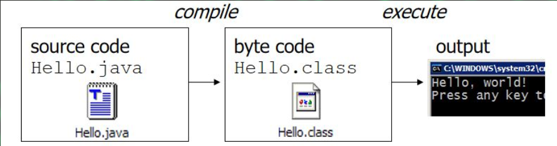
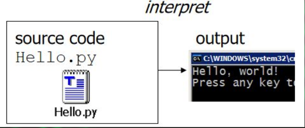
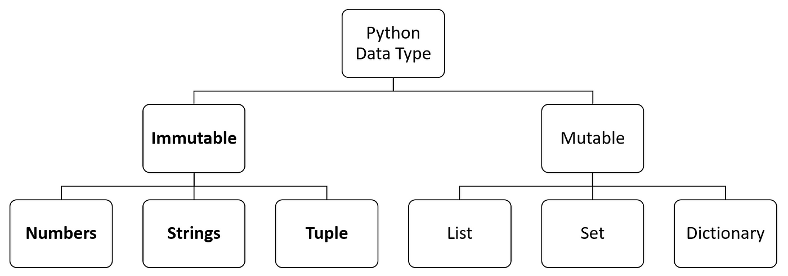
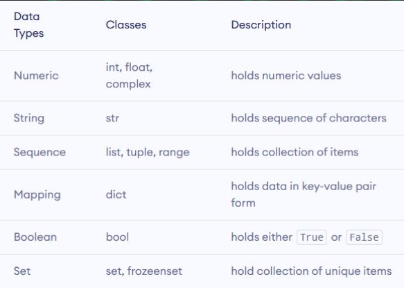
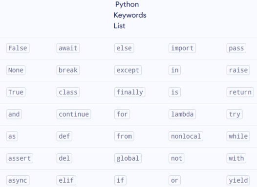

# Introduction to Python Programming

## What is Program?
+ A program is an algorithm expressed in a programming language.
+ An algorithm is a detailed sequence of actions to perform to
accomplish some task. Named after an Iranian mathematician,
Al-Khwarizmi.
+ Technically, an algorithm must reach a result after a finite
number of steps.
+ With those steps Programs Do a Specific task Correctly.

1. **Compilers :** are tools which helps to convert the whole code to bytecode then computer will execute it
   + Example: C,C++,Java,..

 

2. **Interpreter :** can directly execute the code by reading the source code line by line 
   + a) Example: python 

 

   

### 👉 Uses of Programming language

+ Android Application Development
+ Website Development
+ Machine learning
+ Artificial Intelligence
+ Game Development
+ Big data Technology
+ Desktop software development
+ Hacking tool development

### History of python
+ Python was developed by **Guido van Rossum** in the late eighties and early nineties at the National Research Institute for Mathematics and Computer Science in the Netherlands.
+ Python is derived from many other languages, including ABC,
Modula-3, C, C++, Algol-68, SmallTalk, and Unix shell and other
scripting languages.
+ Python is now maintained by a core development team at the
institute, although Guido van Rossum still holds a vital role in directing it's progress.

### 👉 Uses of Python
+ Data visualization
+ Data analysis
+ Machine learning
+ Artificial intelligence
+ Back-end web development (with frameworks like Django and Flask)
+ Game development
+ Hacking Script writing

### IDE & Code editors
+ **IDE ( Integrated Development Enviroment ) :** Is a Software that helps to write & run a Specific Programming language. 
     + Example: PythonIDE
+ **Code Editors :** are softwares those can help to write any
kind of programming languages. And also by adding some compiling/ interpreting feature they can run programs/scripts    
     + Example: Sublime,Vscode

### Outputs and Comments
+ On python, to display output we use keyword **‘print’**
    
      print(object=’’, sep=’’, end=’’)
\n - new line

\t - tab space

     # This is a comment line

### Variables
+ Variables are a value holders /containers/
+ They store data
+ We give some value to some word.

👉 Remember! 
On naming the identifier:
+ Dont use space between words use _ 
+ Dont use numbers as identifier

### Data types

 

  

 

  

### Python Keywords 🔑

 

  

**Lists**
+ List is an ordered collection of similar or different types of items separated by commas and enclosed within brackets [ ].
  + For example, languages = ["Swift", "Java", "Python"]
+ To access items from a list, we use the index number (0, 1, 2 ...). 
  + For example, languages[0]
+ We can add/modify objects to the list, languages.append(“Amharic”)

**Tuple**
+ Tuple is an ordered sequence of items same as a list. The only difference is that tuples are immutable. Tuples once created cannot be modified.
+ we use the parentheses () to store items of a tuple. For example, product = ('Xbox', 499.99)
+ Similar to lists, we use the index number to access tuple items in Python

**Dictionary data**

+ Python dictionary is an unordered collection of items. It stores elements in key/value pairs.
  + user1 = {'username':’nathan26,’password’:’p@$$word’}
     + username and password = key
     + nathan26 & p@$$word = value
+ We use keys to retrieve the respective value. But not the other way around. For example,
